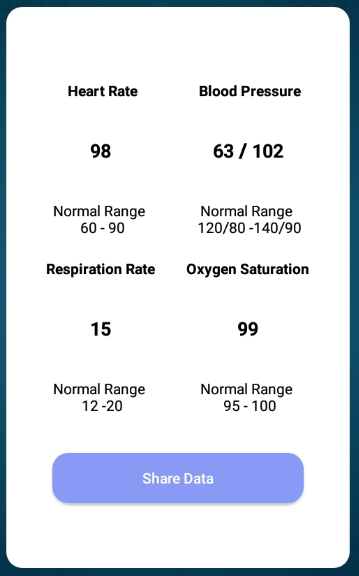
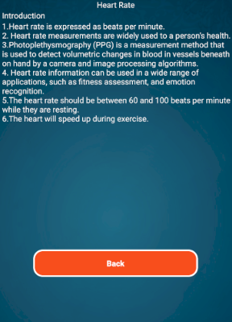

## Demo
Google Drive Link : [here](https://drive.google.com/file/d/1xjTIHt_x7ayFGj8w0CxQTgktLgSrXDKj/view?usp=drive_link)

## Features
- Measurement of heart rate
- Measurement of oxygen rate
- Measurement of resperition rate

## ScreenShot

